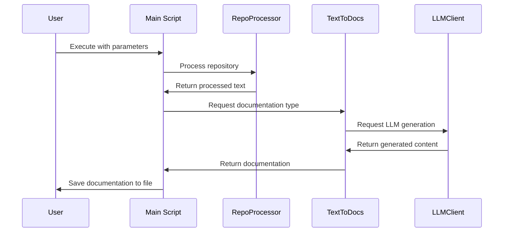

# Repo2Docs: Convert Repositories to Documentation

Inspired by [github2file](https://github.com/cognitivecomputations/github2file)

Repo2Docs is a Python-based tool designed to convert the contents of a repository into comprehensive documentation or diagrams. This tool leverages language model APIs such as OpenAI or Anthropic to process and generate documentation, making it easier for developers to create documentation for their projects.

## How It Works


*Caption: This sequence diagram illustrates the flow of interactions from the user executing the script to the generation and saving of documentation.*


## Using Repo2Docs

To run Repo2Docs on your local machine, follow these steps:

1. **Install Repo2Docs**:
   ```
   pip install repo2docs
   ```


2. **Set Up Environment Variables**:
   Export your OpenAI and Anthropic API keys as environment variables:
   ```
   export OPENAI_API_KEY=your_openai_api_key_here
   export ANTHROPIC_API_KEY=your_anthropic_api_key_here
   ```
   or
   Input your OpenAI or Anthropic API keys when prompted


3. **Run the Tool**:

   cd into the directory where the repo is located
   ```
   cd <path_to_repo>
   ```
   Run the following command to generate documentation:
   ```
   repo2docs --dir_path <path_to_repo> --output_file <output_file> --type <type> --llm <llm>
   ```

   - Leaving `dir_path` empty will default to the current directory.
   - Leaving `output_file` empty will default to `output.md`.
   - Leaving `type` empty will default to `documentation`.
     - To generate mobile documentation, use `--type mobile`.
     - To generate diagrams instead of documentation, use `--type diagram`.
     - To generate database erd diagrams, use `--type database`.
     - To use a custom prompt,leave `type` empty and use `--prompt "<prompt>"`.
   - Leaving `llm` empty will default to `openai`.
     - To use Anthropic, use `--llm anthropic`.
       - Defaults to `claude-3-haiku-20240307`.
       - To use a specific model, use `--llm anthropic:<model>`.
     - To use OpenAI, use `--llm openai`.
       - Defaults to `gpt-4-turbo`.
       - To use a specific model, use `--llm openai:<model>`.

## Supported File Types

Repo2Docs currently supports processing files with the following extensions: `.py`, `.js`, `.jsx`, `.ts`, `.tsx`, `.c`, `.cpp`, `.h`, `.hpp`. It filters out files from directories like `docs`, `examples`, `tests`, and others that are unlikely to contain useful information for documentation.

## Contributing

Contributions to Repo2Docs are welcome! Whether it's adding new features, improving documentation, or reporting issues, feel free to open an issue or submit a pull request.

## License

Repo2Docs is released under the MIT License. See the LICENSE file for more details.


