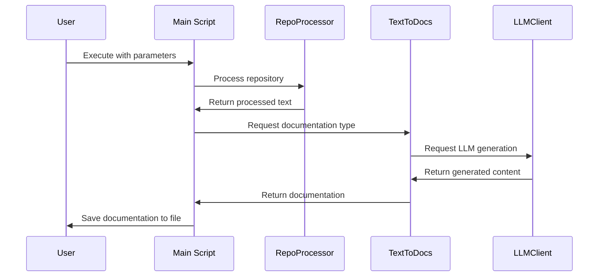

# Repo2Docs: Convert GitHub Repositories to Documentation

Repo2Docs is a Python-based tool designed to convert the contents of a GitHub repository into comprehensive documentation or diagrams. This tool leverages language model APIs such as OpenAI or Anthropic to process and generate documentation, making it easier for developers to create documentation for their projects.

## How It Works


*Caption: This sequence diagram illustrates the flow of interactions from the user executing the script to the generation and saving of documentation.*


## Running Repo2Docs Locally

To run Repo2Docs on your local machine, follow these steps:

1. **Clone the Repository**:
   ```
   git clone https://github.com/earlybird-labs/repo2docs.git
   cd repo2docs
   ```

2. **Create and Activate Virtual Environment**:

   First, ensure you have Python installed on your system. Then, create a virtual environment and activate it:
   
   For macOS/Linux:
   ```
   python3 -m venv venv
   source venv/bin/activate
   ```
   
   For Windows:
   ```
   python -m venv venv
   .\venv\Scripts\activate
   ```

   **Install Dependencies**:
   
   After activating the virtual environment, install the required dependencies by running:
   ```
   pip install -r requirements.txt
   ```

3. **Set Up Environment Variables**:
   Create a `.env` file in the root directory and add your language model API keys:
   ```
   OPENAI_API_KEY=your_openai_api_key_here
   ANTHROPIC_API_KEY=your_anthropic_api_key_here
   ```

4. **Run the Tool**:
   Use the following command to convert a repository to documentation. Replace `path_to_repo.zip` and `output_file.md` with your repository's `.zip` file path and your desired output file path, respectively.
   ```
   python src/main.py path_to_repo.zip output_file.md --type documentation --llm openai
   ```

   To generate diagrams instead of documentation, use `--type diagram`.
   To generate database erd diagrams, use `--type database`.

## Supported File Types

Repo2Docs currently supports processing files with the following extensions: `.py`, `.js`, `.jsx`, `.ts`, `.tsx`, `.c`, `.cpp`, `.h`, `.hpp`. It filters out files from directories like `docs`, `examples`, `tests`, and others that are unlikely to contain useful information for documentation.

## Contributing

Contributions to Repo2Docs are welcome! Whether it's adding new features, improving documentation, or reporting issues, feel free to open an issue or submit a pull request.

## License

Repo2Docs is released under the MIT License. See the LICENSE file for more details.


